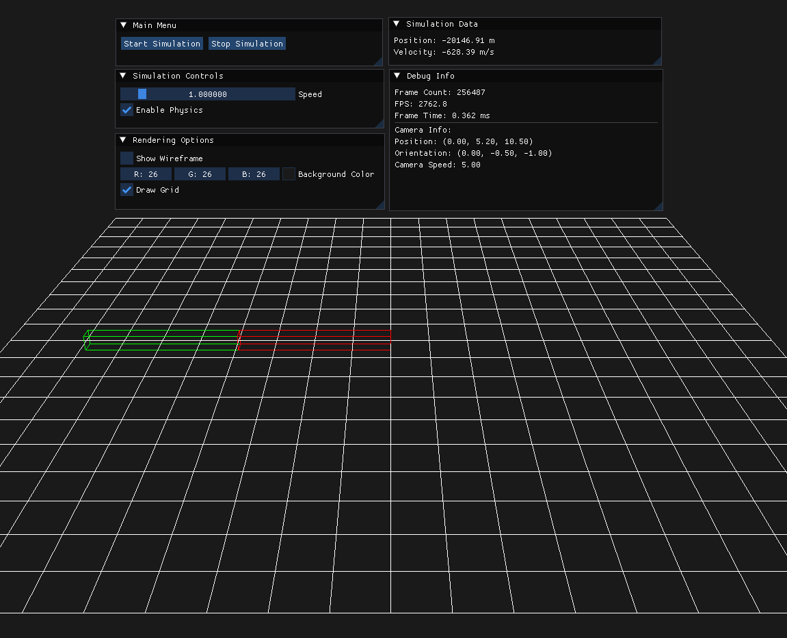

# DynamicsLab

**DynamicsLab** is a real-time simulation tool for multibody dynamics systems. It is designed to help users visualize, analyze, and interact with complex system data efficiently. By combining powerful simulation capabilities with an intuitive interface, **DynamicsLab** supports researchers and engineers in better understanding dynamic systems.

## Alpha Interface


## Features
- **Real-time Simulation**: Simulates rigid body dynamics with position, velocity, and acceleration updates.
- **Interactive Camera**: Provides intuitive camera controls for navigation and inspection of the simulation environment.
- **Modular Project Structure**: Designed for extensibility, making it easier to integrate new features or modify existing functionality.
- **User Interface**: Built using Dear ImGui, providing real-time control and visualization of simulation and camera data.
- **Cross-platform Support**: Based on GLFW and OpenGL, the project is compatible with major OS platforms.

## Camera Movement
The application enables camera navigation to explore the simulation from any viewpoint. Users can control the camera position and orientation via:
- **Mouse Input**:
    - Movement: Adjusts the camera's rotation.
    - Scrolling: Typically configured for zoom functionality.

- **Keyboard Input**:
    - W/A/S/D keys for navigation along the axes.
    - Space/Shift for upward/downward movement.

## Project Tree
```bash
DynamicsLab
├───assets
│   ├───images
│   └───shaders
│       ├───grid.frag.glsl
│       └───grid.vert.glsl
├───include
│   ├───glad
│   ├───KHR
│   ├───application.h
│   ├───dynamics.h
│   ├───imgui_layer.h
│   ├───quaternion_math.h
│   ├───renderer.h
│   ├───rigid_body.h
│   └───simulation.h
└───src
    ├───core
    │   ├───main.cpp
    │   └───application.cpp
    ├───graphics
    │   ├───glad.c
    │   └───renderer.cpp
    ├───simulation
    │   ├───rigid_body.cpp
    │   ├───simulation.cpp
    │   ├───dynamics.cpp
    │   └───quaternion_math.cpp
    └───ui
        └───imgui_layer.cpp
```

## References

1. Nikravesh, Parviz E. *Computer-Aided Analysis of Mechanical Systems*. Prentice-Hall, Inc., USA, 1988. ISBN: 0131642200.

2. GLFW - A multi-platform library for OpenGL, OpenGL ES, and Vulkan development.
   - Website: [https://www.glfw.org](https://www.glfw.org)

3. GLM - OpenGL Mathematics, a header-only C++ library for graphics software.
   - GitHub: [https://github.com/g-truc/glm](https://github.com/g-truc/glm)

4. Dear ImGui - A bloat-free graphical user interface library for C++.
   - GitHub: [https://github.com/ocornut/imgui](https://github.com/ocornut/imgui)

5. Eigen - A C++ template library for linear algebra.
   - Website: [https://eigen.tuxfamily.org](https://eigen.tuxfamily.org)
