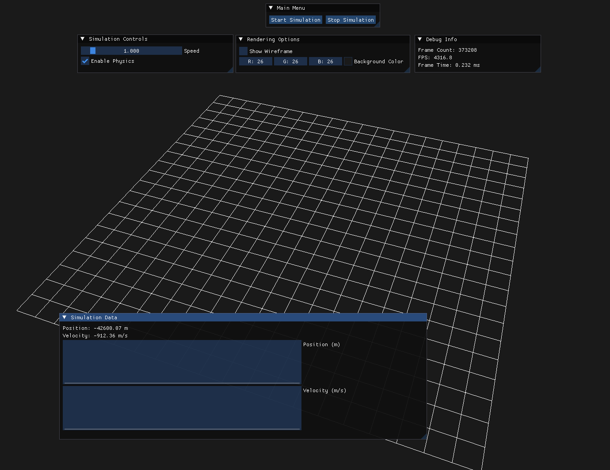

# DynamicsLab

**DynamicsLab** is a real-time simulation tool for multibody dynamics systems. Used to visualize and analyze system data efficiently.

## Alpha Interface


## Project Tree
```bash
DynamicsLab
├───assets
│   ├───images
│   └───shaders
│       ├───grid.frag.glsl
│       └───grid.vert.glsl
├───include
│   ├───glad
│   ├───KHR
│   ├───application.h
│   ├───dynamics.h
│   ├───imgui_layer.h
│   ├───quaternion_math.h
│   ├───renderer.h
│   ├───rigid_body.h
│   └───simulation.h
└───src
    ├───core
    │   ├───main.cpp
    │   └───application.cpp
    ├───graphics
    │   ├───glad.c
    │   └───renderer.cpp
    ├───simulation
    │   ├───rigid_body.cpp
    │   ├───simulation.cpp
    │   ├───dynamics.cpp
    │   └───quaternion_math.cpp
    └───ui
        └───imgui_layer.cpp
```

## References

1. Nikravesh, Parviz E. *Computer-Aided Analysis of Mechanical Systems*. Prentice-Hall, Inc., USA, 1988. ISBN: 0131642200.

2. GLFW - A multi-platform library for OpenGL, OpenGL ES, and Vulkan development.
   - Website: [https://www.glfw.org](https://www.glfw.org)

3. GLM - OpenGL Mathematics, a header-only C++ library for graphics software.
   - GitHub: [https://github.com/g-truc/glm](https://github.com/g-truc/glm)

4. Dear ImGui - A bloat-free graphical user interface library for C++.
   - GitHub: [https://github.com/ocornut/imgui](https://github.com/ocornut/imgui)

5. Eigen - A C++ template library for linear algebra.
   - Website: [https://eigen.tuxfamily.org](https://eigen.tuxfamily.org)
