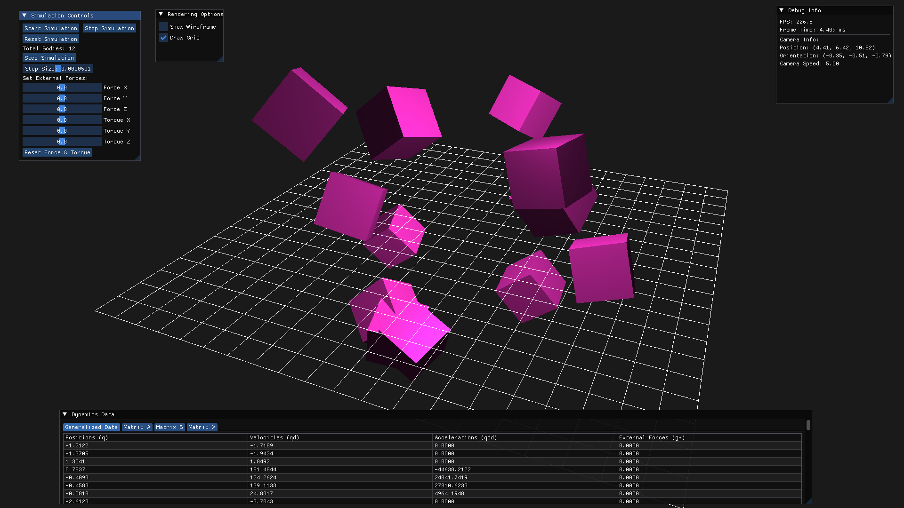

# DynamicsLab Engine

**DynamicsLab** is a work in porgress real-time simulation tool for multibody dynamics systems. It is designed to help
users visualize, analyze, and interact with complex system data efficiently. By combining powerful simulation
capabilities with an intuitive interface.

## Interface



## Features

- **Real-time Simulation**: Simulates rigid body dynamics with position, velocity, and acceleration updates.
- **Interactive Camera**: Provides intuitive camera controls for navigation and inspection of the simulation
  environment.
- **Modular Project Structure**: Designed for extensibility, making it easier to integrate new features or modify
  existing functionality.
- **User Interface**: Built using Dear ImGui, providing real-time control and visualization of simulation and camera
  data.
- **Cross-platform Support**: Based on GLFW and OpenGL, the project is compatible with major OS platforms.

|  |  |  |
|:---------------------------------------------------------------:|:---------------------------------------------------------------:|:---------------------------------------------------------------:|
|   [View Full](./assets/images/screenshot_20250130_104201.png)   |   [View Full](./assets/images/screenshot_20250130_104001.png)   |   [View Full](./assets/images/screenshot_20250130_094453.png)   |

## Camera Movement

The application enables camera navigation to explore the simulation from any viewpoint. Users can control the camera
position and orientation via:

- **Mouse Input**:
    - Movement: Adjusts the camera's rotation.
    - Scrolling: Typically configured for zoom functionality.

- **Keyboard Input**:
    - W/A/S/D keys for navigation along the axes.
    - Space/Shift for upward/downward movement.

# Important Equations

$$ n_i^* = 2 L_i^T n_i' $$
$$ n_i^* = 2 G_i^T n_i $$
$$ J_i^* = 4 L_i^T J_i' L_i $$
$$ H_i = 4 \dot L_i^T J_i' L_i $$

## Unconstrained Body

$$
\begin{bmatrix} M^* & P^T \cr P & 0 \end{bmatrix}
\begin{bmatrix} \ddot q \cr \sigma \end{bmatrix} +
\begin{bmatrix} b^* \cr c \end{bmatrix} =
\begin{bmatrix} g^* \cr 0 \end{bmatrix}
$$

$$
M^* = \begin{bmatrix} N_1 \cr & J_1^* \cr & & N_b \cr & & & J_b^* \end{bmatrix}
\space
P = \begin{bmatrix} 0^T & p_1^T \cr & & 0^T & p_b^T \end{bmatrix}
$$

$$
\ddot q = \begin{bmatrix} \ddot r_1 \cr \ddot p_1 \cr \ddot r_b \cr \ddot p_b \end{bmatrix}
\space
\sigma = \begin{bmatrix} \sigma_1 \cr \sigma_b \end{bmatrix}
$$

$$
b^* = \begin{bmatrix} 0 \cr 2 H_1 \dot p_1 \cr 0 \cr 2 H_b \dot p_b \end{bmatrix}
\space
c = \begin{bmatrix} \dot p_1^T \dot p_1 \cr \dot p_b^T p_b \end{bmatrix} \space
g^* = \begin{bmatrix} f_1 \cr n_1^* \cr f_b \cr n_b^* \end{bmatrix}
$$

## Constrained Body

$$
\begin{bmatrix} M^* & P^T & B^T \cr P & 0 & 0 \cr B & 0 & 0 \end{bmatrix}
\begin{bmatrix} \ddot q \cr \sigma \cr - \lambda \end{bmatrix} +
\begin{bmatrix} b^* \cr c \cr 0 \end{bmatrix} =
\begin{bmatrix} g^* \cr 0 \cr \gamma \end{bmatrix}
$$

## Unconstrained Demo Body

### Initial Position, Orientation, Velocity & Angular Velocity

1 x 1 x 1 m 10 kilogram box.

Mass: $ m = 10 kg $

Moment of Inertia:  $ I = 60 kgm^2 $

$$
r_1 = \begin{bmatrix} 0 \cr 0 \cr 0 \end{bmatrix} \quad
p_1 = \begin{bmatrix} 1 \cr 0 \cr 0 \cr 0 \end{bmatrix} \quad
\dot r_1 = \begin{bmatrix} 0 \cr 0 \cr 0 \end{bmatrix} \quad
\dot p_1 = \begin{bmatrix} 0 \cr 0 \cr 0 \cr 0 \end{bmatrix}
$$

### Mass & Inertia Matrix

$$
N_1 = \begin{bmatrix} 10 & 0 & 0 \cr 0 & 10 & 0 \cr 0 & 0 & 10 \end{bmatrix} \quad
J_1^* = \begin{bmatrix} 0 & 0 & 0 & 0 \cr 0 & 60 & 0 & 0 \cr 0 & 0 & 60 & 0 \cr 0 & 0 & 0 & 60 \end{bmatrix} \quad
$$

# Variable Mapping Table

| **Variable from Book** |                **Description**                 | **Corresponding Name in Code** |                               **Additional Notes**                                |
|:----------------------:|:----------------------------------------------:|:------------------------------:|:---------------------------------------------------------------------------------:|
|        **M\***         |           System mass-inertia matrix           |   `SystemMassInertiaMatrix`    |             Represents the mass and inertia properties of the system.             |
|         **P**          |          Quaternion constraint matrix          |  `QuaternionConstraintMatrix`  |             Handles constraints related to quaternion representation.             |
|         **q**          | Generalized position coordinates of the system |    `GeneralizedCoordinates`    |          Position variables describing the configuration of the system.           |
|     **q̇** (q dot)     |        Generalized velocity coordinates        |    `GeneralizedVelocities`     |            Velocity variables associated with the system coordinates.             |
| **q̈** (q double dot)  |           Generalized accelerations            |   `GeneralizedAccelerations`   |                  Acceleration variables for the system's motion.                  |
|        **b\***         |            Velocity-dependent term             |    `VelocityDependentTerm`     | Represents effects dependent on the velocity, such as Coriolis or damping forces. |
|         **c**          |         Quaternion norm squared value          |    `QuaternionNormSquared`     |                Constraint ensuring quaternions remain normalized.                 |
|        **g\***         |          Generalized external forces           |  `GeneralizedExternalForces`   |                       External forces acting on the system.                       |

## Project Tree

```bash
DynamicsLab
├───assets
│   ├───images
│   └───shaders
│       ├───grid.frag.glsl
│       └───grid.vert.glsl
├───include
│   ├───glad
│   ├───KHR
│   ├───application.h
│   ├───dynamics.h
│   ├───imgui_layer.h
│   ├───graphics.h
│   └───rigid_body.h
└───src
    ├───core
    │   ├───main.cpp
    │   └───application.cpp
    ├───graphics
    │   ├───glad.c
    │   └───graphics.cpp
    ├───simulation
    │   ├───rigid_body.cpp
    │   └───dynamics.cpp
    └───ui
        └───imgui_layer.cpp
```

## References

1. Nikravesh, Parviz E. *Computer-Aided Analysis of Mechanical Systems*. Prentice-Hall, Inc., USA, 1988. ISBN:
   0131642200.

2. GLFW - A multi-platform library for OpenGL, OpenGL ES, and Vulkan development.
    - Website: [https://www.glfw.org](https://www.glfw.org)

3. GLM - OpenGL Mathematics, a header-only C++ library for graphics software.
    - GitHub: [https://github.com/g-truc/glm](https://github.com/g-truc/glm)

4. Dear ImGui - A bloat-free graphical user interface library for C++.
    - GitHub: [https://github.com/ocornut/imgui](https://github.com/ocornut/imgui)

5. Eigen - A C++ template library for linear algebra.
    - Website: [https://eigen.tuxfamily.org](https://eigen.tuxfamily.org)
